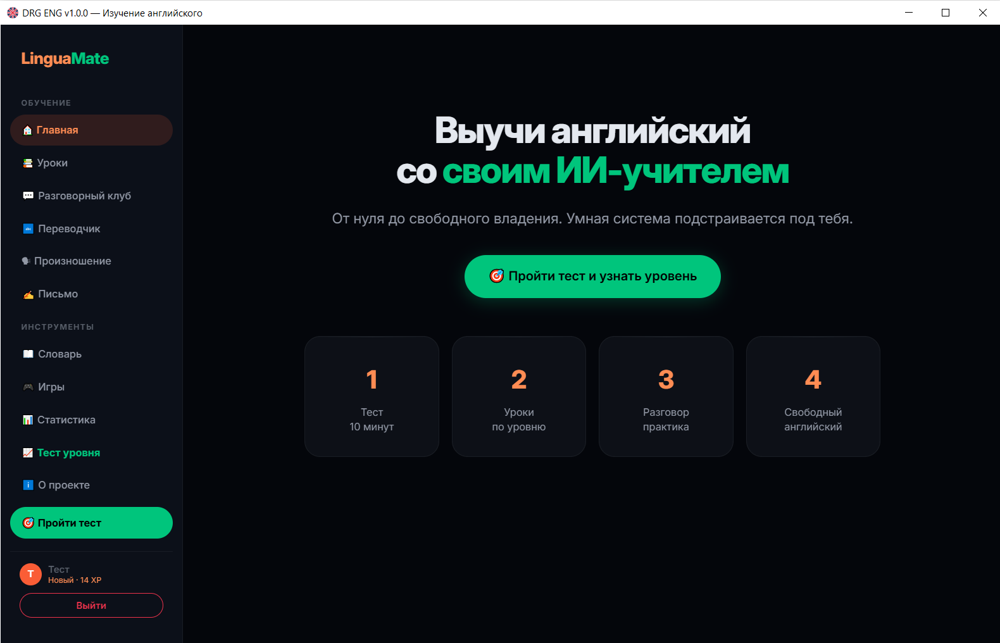
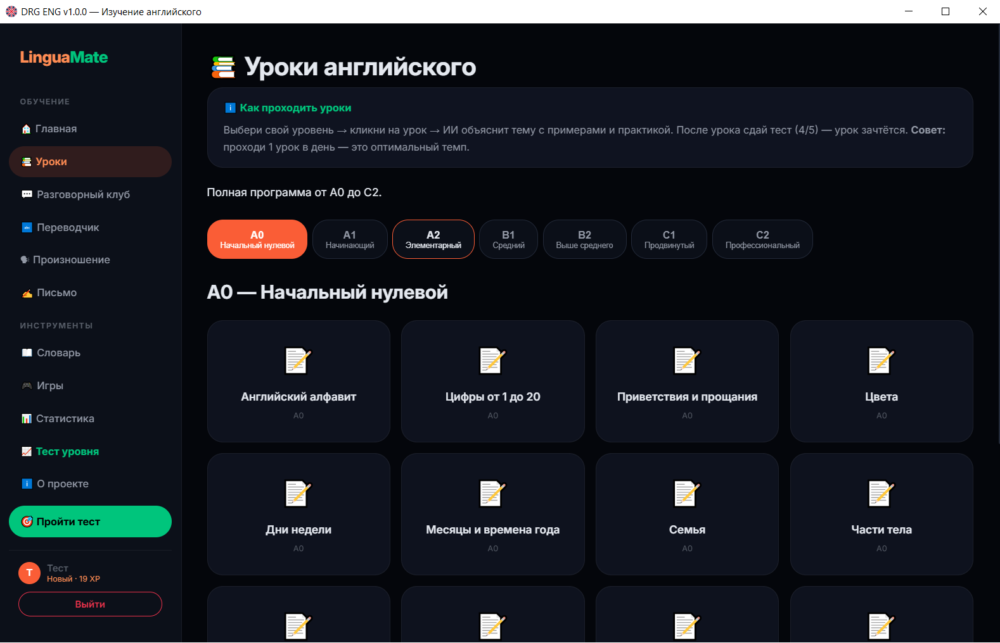
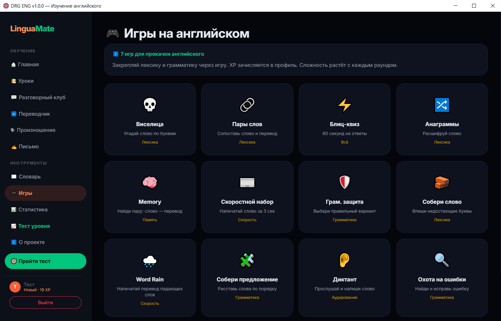

# DRG ENG — Изучение английского языка с ИИ


Персональный ИИ-репетитор английского языка от A0 до C2. Desktop-приложение для Windows 10/11.

> **Требования:** Windows 10/11, [WebView2 Runtime](https://go.microsoft.com/fwlink/p/?LinkId=2124703) (предустановлен в Windows 11, для Windows 10 — установи по ссылке).

## Скриншоты





## Возможности

- **112 уроков** от алфавита до профессионального уровня (C2)
- **Разговорный клуб** с голосовым вводом и озвучкой (SpeechSynthesis, Microsoft Neural голоса)
- **11 обучающих игр**: Виселица, Пары слов, Memory, Блиц-квиз, Word Rain, Собери предложение, Диктант, Грам. защита и др.
- **Тестирование** после каждого урока + экзамены на повышение уровня (CEFR)
- **Словарь** с интервальным повторением (алгоритм SM-2)
- **22 достижения** + система XP
- **Мульти-профили** для всей семьи
- **ИИ-учитель** — поддерживает OpenRouter, OpenAI, DeepSeek, GigaChat, Groq, Together, Mistral, Perplexity, Fireworks и любой OpenAI-совместимый API
- **Нативное Windows-окно** (PyWebView + Edge WebView2)
- **API-ключ** — настраивается при входе, проверяется тестовым запросом, сохраняется в `SaveDRG/`

## Установка

Скачай `DRGENG.exe` из [Releases](https://github.com/Dangergrow/ENG-DRG/releases). Запусти — приложение откроется в собственном окне.

Ни Python, ни браузер не нужны. Данные сохраняются в папке `SaveDRG` рядом с `.exe`. API-ключ вводится на странице входа и проверяется тестовым запросом.

**Бесплатные API-ключи:**
- [OpenRouter](https://openrouter.ai/settings/keys) — бесплатные модели
- [Google AI Studio](https://aistudio.google.com/apikey) — Gemini Flash, без карты
- [Groq](https://console.groq.com/keys) — быстрые Llama, бесплатный тир

## Разработка

```bash
git clone https://github.com/Dangergrow/ENG-DRG.git
cd ENG-DRG
pip install flask openai edge-tts pywebview pyinstaller

python main.py          # Запуск в браузере
python server.py        # Запуск в окне приложения

python make_icon.py                         # Сгенерировать иконку
pyinstaller DRGENG.spec --clean             # Сборка .exe
# Готовый .exe: dist/DRGENG.exe
```

## Структура

```
├── server.py          # Точка входа (Flask + PyWebView)
├── main.py            # Точка входа (Flask + браузер)
├── app.py             # Flask-роуты
├── ai.py              # ИИ (OpenRouter)
├── database.py        # SQLite
├── lessons.py         # 112 уроков
├── placement.py       # Placement test (30 вопросов)
├── prompts.py         # ИИ-промпты
├── config.py          # Конфигурация
├── tts.py             # Edge-TTS (резервный)
├── make_icon.py       # Генератор app.ico
├── DRGENG.spec        # PyInstaller-спек
├── static/
│   ├── css/design-system.css
│   └── js/ (spring.js, particles.js, adaptive-theme.js, animated-icons.js, main.js)
└── templates/         # Jinja2-шаблоны
```

## Автор

**Dangergrow** — [GitHub](https://github.com/Dangergrow)

## Лицензия

MIT © 2026 Dangergrow
